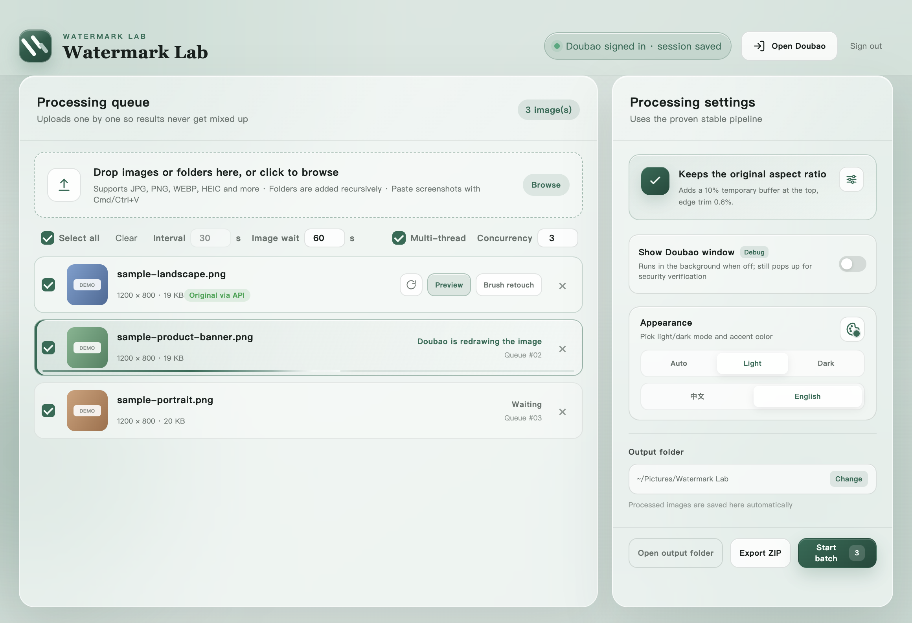

# Watermark Lab

[简体中文](README.md) | **English**

A batch image watermark-removal desktop tool built on **Electron + the Doubao web app**, supporting macOS, Windows, and HarmonyOS NEXT.
All automation runs inside the app's embedded Chromium window — **no Chrome or any other browser required**.

> Doubao (豆包) is ByteDance's AI assistant. A free Doubao account is required; the app drives its web UI to do the actual image processing. The interface ships in Chinese by default and can be switched to English in one click (Processing settings → Appearance).



## Features

- 🚀 **Batch queue with multi-threading**: drag in images or whole folders, or paste screenshots with Cmd/Ctrl+V; process 1–8 images concurrently (default 3) with per-image progress
- 🎯 **Watermark-free originals straight from the API**: intercepts Doubao's SSE responses over the DevTools Protocol and grabs the server-side `image_ori_raw` full-size original — no cropping, no re-encoding (approach inspired by doubao-no-watermark)
- 🛡 **Automatic fallback**: when API capture misses, the image is resent in the same conversation with a temporary buffer strip and processed through the "page capture + precise crop" pipeline; completed tasks carry a capture-source badge (API / fallback / page)
- 🧠 **Conversation memory & verification self-healing**: each image owns its conversation and reconnects after an app restart; when multiple tasks trigger security verification at once, only one verification window pops up — complete it once and every interrupted task reruns automatically (including the phone-number verification that may follow the CAPTCHA)
- 🖌 **Manual brush retouch & automatic QC**: paint over residual watermarks for a second localized repair; every result is compared pixel-by-pixel against the source, suspicious results get a warning badge, and the preview offers "compare with source" and "diff heatmap" views
- 🌐 **Bilingual UI**: Chinese by default, switchable to English in one click — UI, task progress, system dialogs, and notifications all follow, and the built-in prompts switch language too
- 🎨 **Theme color everywhere**: change the palette and the UI, logo, macOS Dock icon, and Windows taskbar icon all follow
- 📦 **Batch export, system notifications, auto-update**: export checked results as a ZIP in one click; get a system notification when a batch finishes; desktop builds check GitHub for new versions automatically
- 💻 **Three platforms**: macOS (Apple silicon), Windows (x64 / ARM64), HarmonyOS NEXT (Tablet / 2-in-1)

## Quick start

### Option 1: download a prebuilt package (recommended)

Grab the build for your platform from [Releases](../../releases):

| Platform | File | Notes |
| --- | --- | --- |
| macOS (Apple silicon) | `*-mac-arm64.dmg` / `.zip` | Unsigned; if macOS says the app "is damaged", run `xattr -cr /Applications/水印清理工作台.app` (see below) |
| Windows x64 | `*-win-x64-setup.exe` | Installer (custom install directory supported); if SmartScreen warns, click "More info → Run anyway" |
| Windows x64 | `*-win-x64-portable.exe` | Portable, no install needed; new versions are downloaded next to the current exe automatically; see below if "Smart App Control" blocks it |
| Windows ARM64 | `*-win-arm64-setup.exe` / `*-win-arm64-portable.exe` | For ARM devices such as Surface Pro X |
| HarmonyOS NEXT | `*-ohos-arm64.hap` | Tablet / 2-in-1; the unsigned HAP must be installed via DevEco Studio auto-signing, see [HarmonyOS guide](docs/HARMONYOS.md) |

**About the macOS "damaged" warning**: the app is not Apple-signed, so Gatekeeper quarantines downloaded copies and recent macOS versions report them as "damaged" (the file is fine). After dragging the app into Applications, run once:

```bash
xattr -cr /Applications/水印清理工作台.app
```

Then it opens normally (right-click → Open also works). The command only removes the quarantine flag for this app.

**About Windows "Smart App Control blocked an unsafe app"**: some fresh Windows 11 installs enable Smart App Control by default, which blocks apps without a code-signing certificate and offers **no "run anyway" option**. This project does not purchase a signing certificate (the block does not mean the software is malicious — the full source is public, and you can build it yourself). If blocked: open **Windows Security → App & browser control → Smart App Control settings → select "Off"**. Note the switch is one-way (it cannot be re-enabled without resetting the system) and turning it off does not affect antivirus or other protection. Regular SmartScreen warnings are unaffected — just click "More info → Run anyway".

First run:

1. Click "Sign in / Open Doubao" and complete the sign-in inside the embedded Doubao window (only needed once).
2. Drag images into the main window (or click to browse) and set the output folder.
3. Check the tasks you want and click "Start batch" at the bottom of the settings panel. Keep the Doubao window open while tasks run.

### Option 2: run from source

Requires Node.js 20+ (development only; no system browser needed at runtime):

```bash
npm install
npm start
```

## Settings reference

| Setting | Location | Description |
| --- | --- | --- |
| Interval | Queue toolbar | Seconds to wait after each image in serial mode; ignored in multi-thread mode (all tasks run simultaneously) |
| Image wait | Queue toolbar (right of Interval) | Seconds to keep waiting for the image after Doubao's reply ends (5–300, default 60); increase it if slow generations get misjudged |
| Multi-thread | Queue toolbar, right side | Process multiple images at once; turn it off or lower the count if security verification triggers frequently |
| Concurrency | Queue toolbar (right of Multi-thread, shown only when enabled) | Max simultaneous tasks (1–8, default 3); higher values use more memory |
| Show Doubao window | Settings panel | Recommended on while debugging; turn off for background processing — the window still pops up for security verification |
| Appearance | Settings panel | Light/dark mode and accent color; click the palette button for the color popover |
| Language | Settings panel (inside Appearance) | Chinese / English one-click switch (Chinese by default); the built-in prompts reset to the matching language |
| Prompts & buffer strip | Settings panel (gear icon, separate window) | Customize prompts, buffer position (top/bottom), ratio, and edge-trim compensation (the buffer is only used by the fallback resend) |

## Building

```bash
npm run dist                      # current platform (macOS: dmg + zip)
npx electron-builder --win --x64  # cross-build Windows x64 from macOS
npm run dist:ohos                 # HarmonyOS HAP (template lives in ohos/, see docs/HARMONYOS.md)
```

Artifacts land in `dist/`. Without a code-signing certificate the signing step is skipped (harmless; see the first-open notes above). For HarmonyOS device support, signing, debugging, and building from scratch, see [docs/HARMONYOS.md](docs/HARMONYOS.md). To port your own Electron app to HarmonyOS, reuse the bundled Kimi Skill [skills/electron-harmonyos](skills/electron-harmonyos/).

## Testing

```bash
npm run check   # syntax-check all sources
npm test        # unit tests (test/ directory, 69 cases)
```

`scripts/` contains end-to-end test scripts that drive the real app and a signed-in Doubao page over the Chrome DevTools Protocol, covering conversation reconnection, parallel cancellation, no-image errors, and more. They require a signed-in Doubao session on this machine; some probes take a test conversation via an environment variable:

```bash
DOUBAO_TEST_CONVERSATION='https://www.doubao.com/chat/your-conversation-id' node scripts/e2e-reply-extract-probe.cjs
```

## How it works

The app automates the Doubao web UI inside an embedded Chromium window: upload the untouched source image → send the prompt → read the `chat/completion` SSE response body through the CDP Network domain and extract the server-side `image_ori_raw` watermark-free original for direct export — no page injection, no behavioral changes. When capture misses, it falls back automatically: the image is resent in the same conversation with a temporary buffer strip and handled by the original pipeline (watching page DOM images and network image requests, picking the best candidate, cropping the buffer away). Doubao offers no stable public automation API for this flow, so control targeting uses semantics, positions, and multi-selector fallbacks; the core logic lives in `src/doubao-automation.js` for easy maintenance when the page structure changes.

## Project layout

```
src/
  main.js               Main process: windows, batch scheduling, conversation memory, settings & queue persistence
  doubao-automation.js  Doubao page automation: sign-in, upload, send, candidate capture, reply extraction
  image-pipeline.js     Image processing: candidate download, canvas export, buffer-strip cropping
  prompt.js             Built-in prompts (Chinese and English)
  renderer/             Main window UI (queue, settings, progress, toasts) + i18n dictionary
scripts/                End-to-end test scripts
test/                   Unit tests
ohos/                   HarmonyOS project template (openharmony-sig/electron prebuilt engine, compressed in prebuilt/)
skills/                 electron-harmonyos: a Kimi Skill for porting Electron apps to HarmonyOS (with .skill package)
```

## Disclaimer & limitations

- This project is for learning and technical exchange only. Only process images you own or are authorized to edit, and comply with Doubao's terms of service and the laws and regulations on labeling AI-generated content.
- "Original candidate captured" means a full-size link without known processing/watermark parameters was obtained; it is not an absolute guarantee that the image content carries no watermark.
- Doubao page updates may break the automation; please file an Issue if you hit problems.

## License

[MIT](LICENSE)
