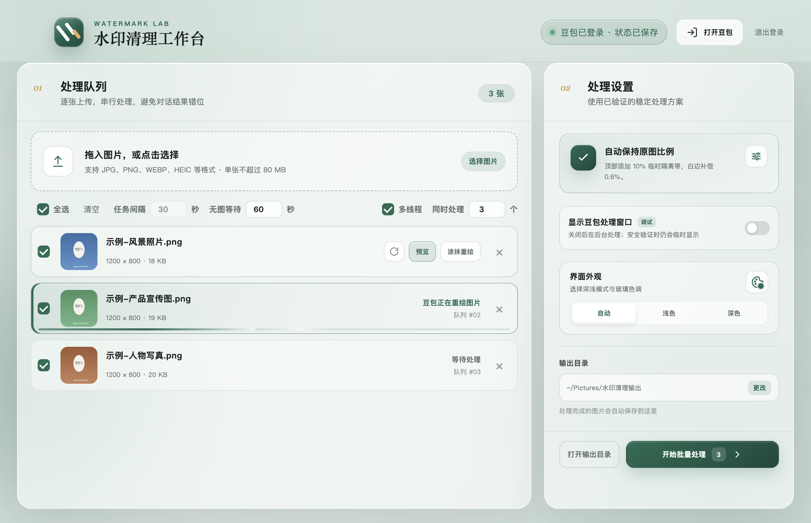

# 水印清理工作台

基于 **Electron + 豆包网页版**的批量图片去水印桌面工具，支持 macOS 与 Windows。
自动化运行在应用内嵌的 Chromium 窗口中，**无需安装 Chrome 或任何浏览器**。



## 功能特性

- **批量任务队列**：拖拽图片或整个文件夹（自动收纳夹内全部图片），支持勾选 / 全选 / 清空，任务列表可滚动，逐张显示进度条与状态
- **多线程并行**：同时处理多张图片，并行数量 1–8 可调（默认 3）；批处理、重新生成、涂抹重绘共用该上限，任务启动自动错开节奏
- **验证码自动恢复**：触发豆包安全验证时任务暂停并弹出豆包窗口，手动完成验证后被中断的任务自动整任务重新开始（最多 2 次）；多线程下同批正在执行的任务会一并重启，避免豆包假死或静默放弃生成导致的长时间卡死
- **会话记忆**：每个任务独占一个豆包会话并记住会话 ID——重跑某张图、重启软件后，都会自动接回该图的历史对话继续处理，不会新建一堆会话；对话在网页端被删除后自动新建会话并更新记录
- **无图等待可调**：豆包回复结束后等待图片出现的秒数可在界面调整（默认 60 秒），出图慢时不再被误判"没有生成图片"
- **干净的报错**：生成失败时右下角提示只保留豆包的回复摘要，不混入提示词和页面杂质
- **手动涂抹修复**：对残留水印手动涂抹标记，走二次局部修复
- **原图优先下载**：同时观察页面图片节点与网络图片请求，优先获取分辨率最高的原始候选；失败时回退高清画布导出
- **AI 标识处理**：默认添加临时隔离带让豆包 AI 标识落在带内，生成后按原图比例精确裁除并做白边补偿（顶部/底部、比例均可调）
- **登录持久化**：豆包登录会话存放在独立持久化分区，重启应用保持登录
- **前后对比预览**：预览窗口支持"对比原图"模式，拖动分割线逐像素核对处理质量
- **自动质检**：每张结果保存后自动与原图逐像素对比——差异过小（疑似豆包"假装处理了"）或异常过大都会给任务打上黄标提示；预览窗口内可切换"差异热力"视图，红色区域直观标出与原图的差异位置
- **主题色联动**：调色盘（含自定义颜色）一改，界面、左上角 logo、Dock（macOS）与任务栏窗口图标（Windows）全部跟随换色；图标只旋转底渐变色相，条纹与质感保持原样
- **一键批量导出**：勾选生成好的任务后点"批量导出"，把结果打包成一个 ZIP 压缩包，重名自动加序号
- **应用内自动更新**：启动时自动检查 GitHub Releases 新版本（Windows 安装版后台下载、重启即升级；Windows 便携版自动下载新版便携包到当前 exe 所在目录，关闭软件运行新文件即可；macOS 发现新版本会弹窗提示，可一键下载安装包并打开，拖入「应用程序」替换即可）

## 快速开始

### 方式一：下载打包好的应用（推荐）

前往 [Releases](../../releases) 下载对应平台：

| 平台 | 文件 | 说明 |
| --- | --- | --- |
| macOS（Apple 芯片） | `*-mac-arm64.dmg` / `.zip` | 未签名，打开提示"已损坏"时在终端执行 `xattr -cr /Applications/水印清理工作台.app` 即可（见下方说明） |
| Windows x64 | `*-win-x64-setup.exe` | 安装版（安装向导中可自选安装目录），SmartScreen 提示时点"更多信息 → 仍要运行" |
| Windows x64 | `*-win-x64-portable.exe` | 便携版，免安装直接运行；发现新版本时会自动下载新版便携包到当前 exe 所在目录；如被"智能应用控制"拦截见下方说明 |
| Windows ARM64 | `*-win-arm64-setup.exe` / `*-win-arm64-portable.exe` | Surface Pro X 等 ARM 设备 |

**macOS "已损坏"提示说明**：应用未做 Apple 签名，浏览器下载的文件会被 Gatekeeper 加上隔离属性，新版 macOS 对此直接报"已损坏"（文件本身并没有坏）。把应用拖入「应用程序」文件夹后，在终端执行一次：

```bash
xattr -cr /Applications/水印清理工作台.app
```

之后即可正常双击打开（也可以右键 → 打开）。该命令仅移除这个应用的下载隔离标记，不影响系统其他设置。

**Windows "智能应用控制已阻止可能不安全的应用"说明**：部分全新安装的 Windows 11 默认开启"智能应用控制"（Smart App Control），它会直接拦截没有代码签名证书的应用，且**没有"仍要运行"选项**。本项目未购买签名证书（拦截不代表软件有问题，源码全部公开，不放心可自行从源码构建）。如遇此拦截：打开 **Windows 安全中心 → 应用和浏览器控制 → 智能应用控制设置 → 选择"关闭"**，之后即可正常运行。注意该开关是单向的，关闭后无法再开启（除非重置系统），关闭不影响杀毒等其他防护。普通 SmartScreen 拦截不受此限，点"更多信息 → 仍要运行"即可。

首次使用：

1. 点击"登录 / 打开豆包"，在内置豆包窗口中完成登录（只需一次）。
2. 把图片拖进主窗口（或点击选择），设置输出目录。
3. 勾选要处理的任务，点击处理设置面板底部的"批量处理"。任务期间保持豆包窗口开启。

### 方式二：从源码运行

要求 Node.js 20+（仅开发需要，运行时不需要系统浏览器）：

```bash
npm install
npm start
```

## 界面设置说明

| 设置 | 位置 | 说明 |
| --- | --- | --- |
| 任务间隔 | 队列工具栏 | 串行模式下每张图处理完成后等待的秒数；多线程模式自动错开节奏 |
| 无图等待 | 队列工具栏（任务间隔右侧） | 豆包回复结束后继续等待图片出现的秒数（5~300，默认 60）；出图慢被误判时调大 |
| 多线程 | 队列工具栏右侧 | 开启后同时处理多张图片；频繁触发安全验证时建议关闭或调低数量 |
| 同时处理 | 队列工具栏右侧（多线程右侧，仅开启多线程时显示） | 最多同时处理的任务数（1~8，默认 3）；数量越大内存占用越高 |
| 显示豆包窗口 | 右侧处理设置面板 | 调试时建议开启，稳定后可关闭转为后台运行；安全验证时窗口仍会临时显示 |
| 界面外观 | 右侧处理设置面板 | 点击调色盘按钮弹出气泡设置主题色，不改变面板布局 |
| 提示词与隔离带 | 右侧处理设置面板（齿轮，独立窗口） | 自定义提示词、隔离带位置（顶部/底部）、隔离带比例与白边补偿比例 |

## 打包

```bash
npm run dist                      # 当前平台（macOS：dmg + zip）
npx electron-builder --win --x64  # 在 macOS 上交叉打包 Windows x64
```

产物输出到 `dist/`。未配置代码签名证书时会跳过签名（不影响使用，首次打开按上表提示操作）。

## 测试

```bash
npm run check   # 全部源码语法检查
npm test        # 单元测试（test/ 目录，51 个用例）
```

`scripts/` 下是端到端实测脚本，通过 Chrome DevTools Protocol 驱动真实应用与已登录的豆包页面，覆盖会话接回、并行停止、无图报错等场景。运行前需要本机已登录豆包；个别探测脚本需要通过环境变量传入测试会话，例如：

```bash
DOUBAO_TEST_CONVERSATION='https://www.doubao.com/chat/你的会话ID' node scripts/e2e-reply-extract-probe.cjs
```

## 工作原理

应用在嵌入的 Chromium 窗口中自动化豆包网页版：上传原图 → 发送提示词 → 同时监听页面 DOM 图片与网络图片请求 → 挑选最优候选下载 → 裁除临时隔离带并导出。豆包没有为这一网页流程提供稳定的公开自动化接口，控件定位采用语义、位置与多选择器回退，核心逻辑位于 `src/doubao-automation.js`，页面结构更新后便于集中维护。

## 项目结构

```
src/
  main.js               主进程：窗口、批处理调度、会话记忆、设置与队列持久化
  doubao-automation.js  豆包页面自动化：登录、上传、发送、候选捕获、回复提取
  image-pipeline.js     图片处理：候选下载、画布导出、隔离带裁除
  prompt.js             内置提示词
  renderer/             主窗口界面（队列、设置、进度、提示）
scripts/                端到端实测脚本
test/                   单元测试
```

## 免责与限制

- 本项目仅供学习与技术交流。请只处理你拥有或已获授权编辑的图片，遵守豆包服务条款以及 AI 生成内容标识的相关法律法规。
- "原始资源候选"表示成功获取了不含已知图片处理 / 水印参数的大图链接，不构成对图片内容绝对无水印的保证。
- 豆包页面结构更新可能导致自动化失效，如遇问题请提交 Issue。

## License

[MIT](LICENSE)
